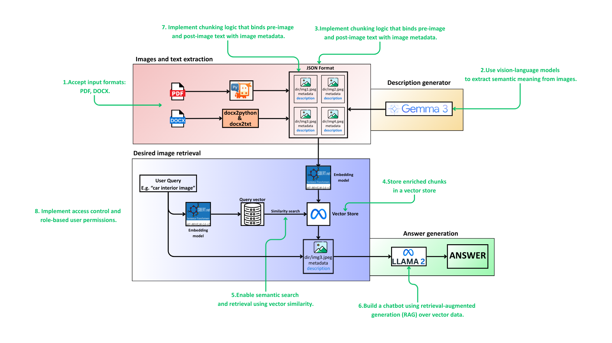

# VISIONDOC AI
A GenAI system that interprets and semantically links embedded images within narrative documents for visual question answering and retrieval.

1.	Accepts input formats: PDF, DOCX.
2.	Uses a vision-language model (GEMMA3) to extract semantic meaning from images.
3.	Implements chunking logic that binds pre-image and post-image text with image metadata.
4.	Stores enriched chunks in a vector store (FAISS).
5.	Enables semantic search and retrieval using vector similarity.
6.	Builds a chatbot using retrieval-augmented generation (RAG) over vector data.
7.	Ensures chunk provenance (page, image position) is preserved.
8.	Implements access control and role-based user permissions.

# PURPOSE
Let's take for example an auto brochure for Porsche Cayenne Turbo 2006. 

It identifies each image and relevant text near it.

A description for each image is also created. Whenever the user asks for an image, he receives the most relevant picture.

The projects supports Q&A retrieval on multiple docx and pdf files.

# LOGIC:

# USAGE:

Step 1: Add your desired documents into VisionDOC-AI/documents directory (remove any existing documents if you don't intend to use them)

Step 2: Run documents_extraction.py (extracts information about documents)

Step 3: Run main.py

While running main.py:
- use user: 'user1' and password: 'user1pwd' for admin permissions
- type the filename of your desired document file (e.g.: Cayenne_Turbo_2006.pdf)
- now, you can ask the model about any image that exists in the document
